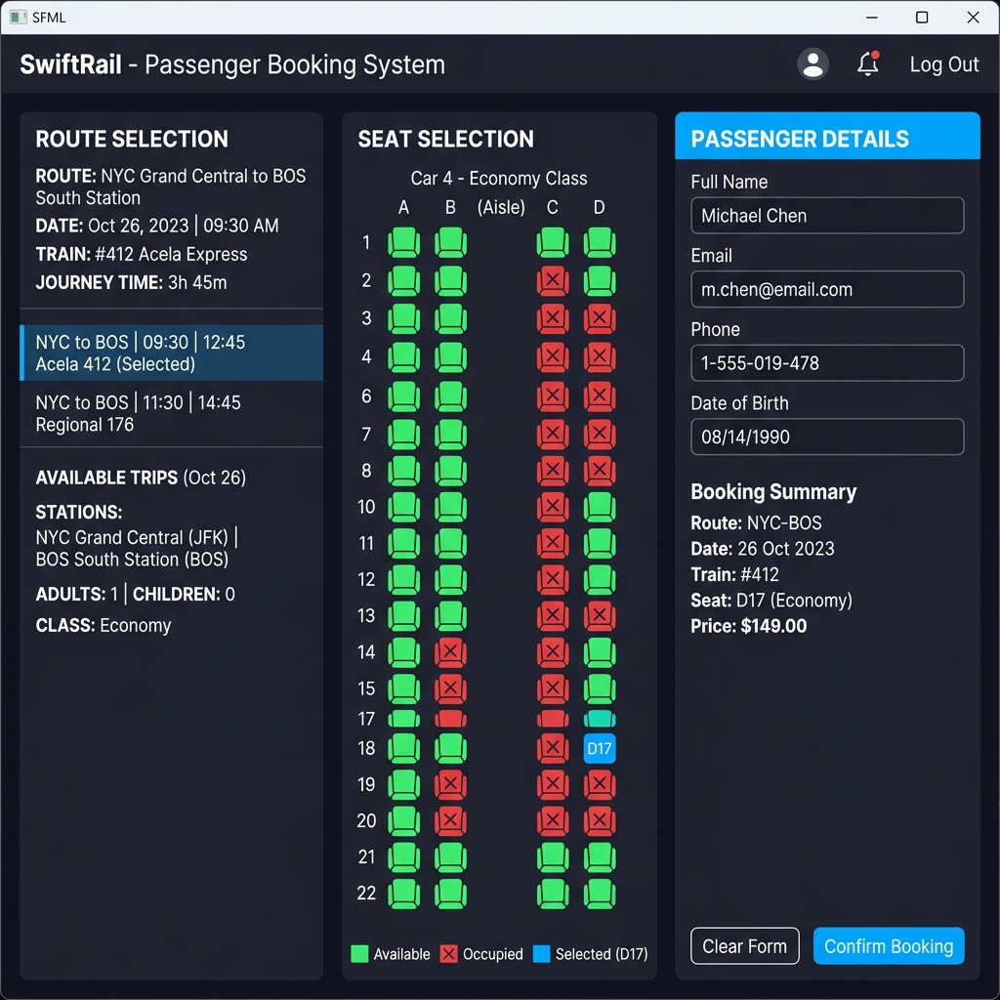

# Passenger Booking System (SFML)

A modern, graphical C++ application for managing passenger bookings, built using the **SFML (Simple and Fast Multimedia Library)**. This system provides a step-by-step workflow for selecting seats, choosing routes, and entering passenger information.



## 🚀 Features

- **Graphical User Interface**: Built with SFML 3 for a smooth and responsive experience.
- **Seat Selection**: Interactive grid to view available seats and reserve them.
- **Route Management**: Choose from various travel routes with estimated travel times.
- **Passenger Information**: Securely enter and validate passenger details.
- **Booking Confirmation**: Summary of the booking with a sleek visual confirmation.
- **Data Persistence**: Automatically saves booking details to `booking.txt` for record-keeping.

## 🛠️ Screens

1. **Seat Screen**: Visualize and select your preferred seat.
2. **Route Screen**: Choose your destination (e.g., Islamabad to Lahore, Karachi, or Kashmir).
3. **Info Screen**: Enter personal details like Name, Phone Number, and Age.
4. **Confirm Screen**: Review your total price and finalize the booking.

## 💻 Technical Requirements

- **C++ Compiler**: (MinGW/GCC recommended)
- **SFML 3**: Required for graphics and window management.
- **Font**: Uses `arial.ttf` (standard Windows font path).

## 🔨 How to Build and Run

To compile the project on Windows (using MinGW), use the following command:

```powershell
g++ main.cpp -o PassengerBooking -lsfml-graphics -lsfml-window -lsfml-system
```

To run the application:
```powershell
./PassengerBooking
```

## 📄 Output
The system generates a `booking.txt` file upon completion, containing:
- Passenger Name
- Phone Number
- Age
- Selected Route & Price
- Total Calculation

---
*Created as a C++ Programming Project.*
